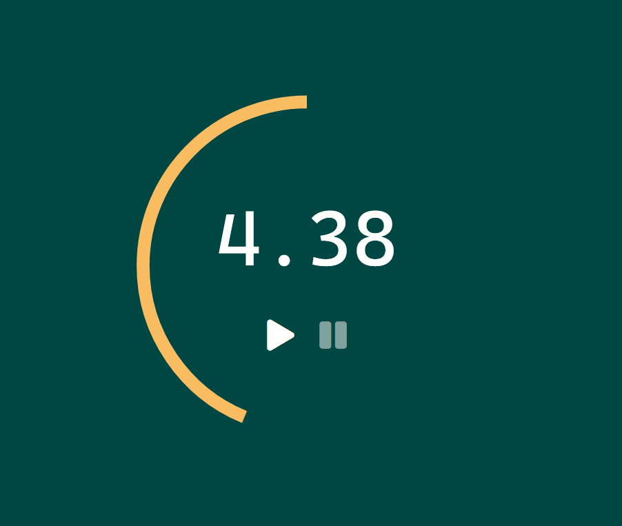

# Timer ⏳

Timer counter, part of the [Modern JavaScript Bootcamp Udemy Course](https://www.udemy.com/course/javascript-beginners-complete-tutorial/)

### [Live Demo](https://mat2ja.github.io/timer/)

