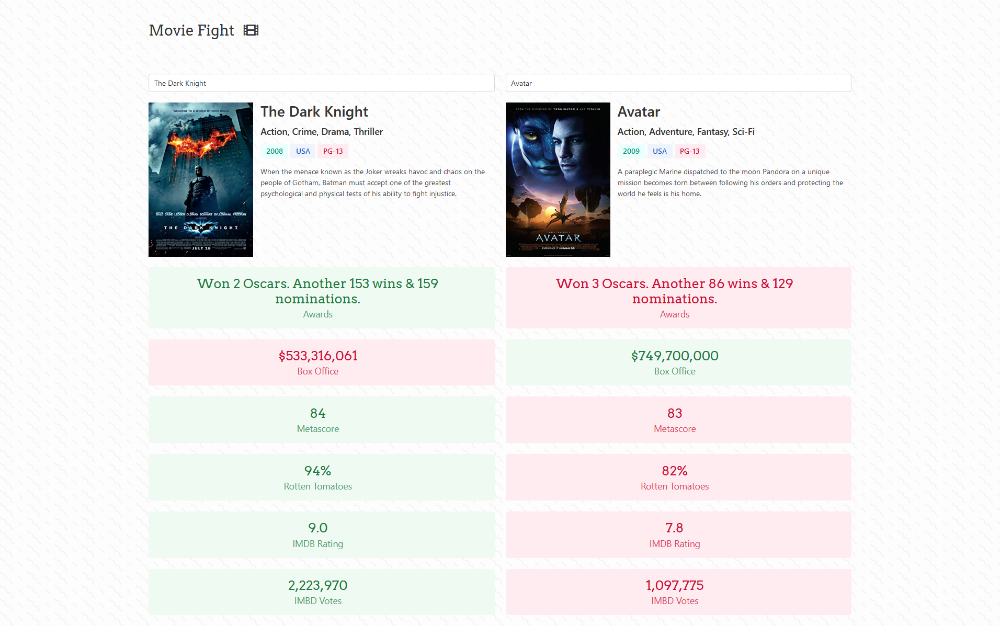

# Movie Fight 🥊

Movie comparison app, part of the [Modern JavaScript Bootcamp Udemy Course](https://www.udemy.com/course/javascript-beginners-complete-tutorial/)

Tools used: plain JavaScript, [Bulma](https://bulma.io/), [axios](https://github.com/axios/axios), [OMDb API](https://www.omdbapi.com/)

[Link to original commits](https://github.com/Mat2ja/modern-javascript-bootcamp-2020/commits/master/21-App-Design-Patterns/MovieFight)

#### [Live Demo (_Github Pages_)](https://mat2ja.github.io/movie-fight/)

#### [Live Demo (_Vercel_)](https://movie-fight-vert.vercel.app/)

#### [Live Demo (_Netlify_)](https://clever-babbage-b11d99.netlify.app/)

#### [Live Demo (_Fleek_)](https://mat2ja.github.io/movie-fight/)
